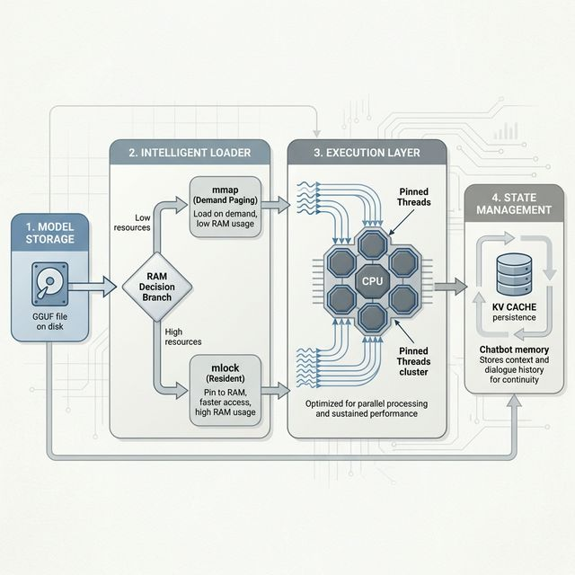

# TrueLarge-RT: High-Performance GGUF Runtime for Android

TrueLarge-RT is a native Android inference engine built on top of `llama.cpp`. It is designed for maximum efficiency, providing real-time telemetry and advanced benchmarking for Large Language Models (LLMs) on mobile hardware.

## Key Features

- **Native llama.cpp Integration**: Pure C++ core for maximum performance and low-level hardware optimization.
- **Advanced Benchmarking**: 5-question standardized suite with real-time TPS, RAM, and CPU frequency graphing.
- **Auto-Discovery**: Automatically recognizes manually added GGUF models in `/Downloads/TrueLarge/models`.
- **Smart Memory Management**: Dynamic `mlock` support and RAM-aware loading to prevent OOM crashes.
- **Multi-Turn Persistence**: Optimized KV cache management for fast, conversational multi-turn inference.
- **Developer-First Logging**: Detailed telemetry including CPU Core ID (#ID) tracking for performance profiling.

## Low-RAM Optimization (4GB Devices)

TrueLarge-RT is optimized to run large models (7B - 13B) even on constrained hardware:
- **Smart Paging (Mmap)**: Automatically disables `mlock` when low RAM is detected, leveraging high-speed storage as virtual memory.
- **KV Cache Capping**: Caps context buffers to 2048 tokens to maintain a stable memory footprint.
- **CPU Affinity**: Intelligent thread mapping to "Big" performance cores to minimize latency during memory swaps.

## Architecture: Hybrid Loading Strategy

TrueLarge-RT employs a unique 3-tier loading strategy to enable large models (up to 13B+) on mobile devices with limited RAM (4GB-8GB):

1.  **Full RAM (mlock)**:
    - **Trigger**: `Free RAM > Model Size + 1GB`.
    - **Behavior**: Locks the entire model in memory to prevent swapping. Delivers maximum speed.
2.  **OS Paging (mmap)**:
    - **Trigger**: `Free RAM > 75% of Model Size`.
    - **Behavior**: Uses standard memory mapping. The OS handles paging pages in/out as needed. This is efficient for models that *mostly* fit in RAM.
3.  **Layer-by-Layer (LBL)**:
    - **Trigger**: `Free RAM < 75% of Model Size`.
    - **Behavior**: Loads one layer at a time from storage, computes, and unloads.
    - **Benefit**: Runs huge models (e.g., 7B on 3GB RAM) that would otherwise crash. Slower, but enables inference on constrained hardware.

## Comparison with Other Runtimes

| Feature | TrueLarge-RT | SmolChat | ONNX Runtime | Google AICore |
| :--- | :--- | :--- | :--- | :--- |
| **Core** | `llama.cpp` (Native) | Web/High-level | General Purpose | Proprietary |
| **Model Format** | GGUF (Optimized) | Various | ONNX | Proprietary |
| **Openness** | Any GGUF model | Limited | Broad | Restricted (Gemini) |
| **Telemetry** | Real-time TPS/RAM/CPU | Minimal | Profiling Tools | Opaque |
| **Persistence** | Native KV Cache | Session-based | Execution Provider | System-level |

### Why TrueLarge-RT?
Unlike general-purpose runtimes like **ONNX**, TrueLarge-RT is laser-focused on the GGUF ecosystem, leveraging `llama.cpp`'s highly optimized ARM NEON and DotProd kernels. Compared to **AICore**, it offers complete freedom—allowing researchers and developers to run any model (Qwen, Llama, Phi, Mistral) without proprietary restrictions.

## Mobile Performance

*Benchmarks pending. Currently testing on Snapdragon 8 Gen 2 / Gen 3 devices.*

## Getting Started

1. **Clone the Repo**: `git clone https://github.com/nareshis21/Truelarge-RT.git`
2. **Setup Models**: Paste your `.gguf` files into `/sdcard/Download/TrueLarge/models/`.
3. **Run**: Build via Android Studio and use the **Benchmark** icon (AutoGraph) to profile your hardware.

## License
MIT License. Built for the open-source LLM community.
