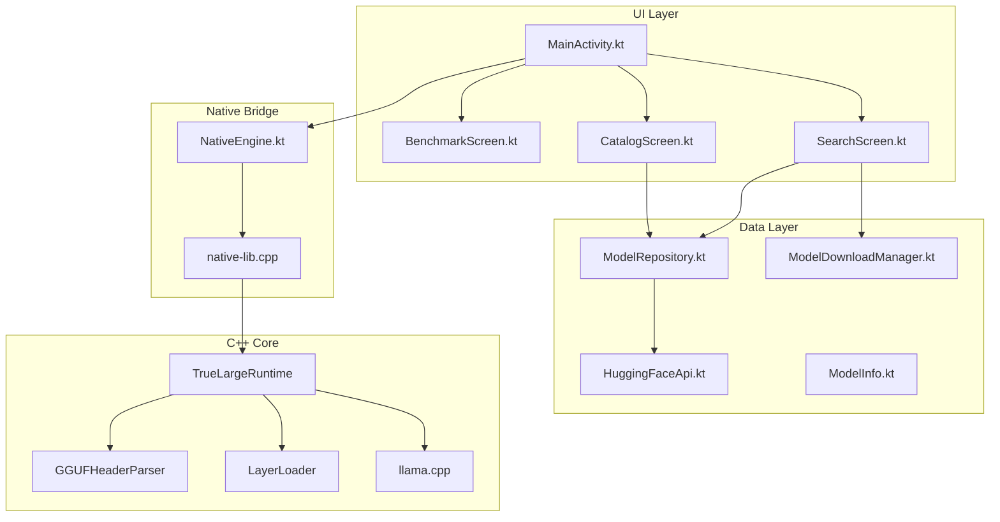
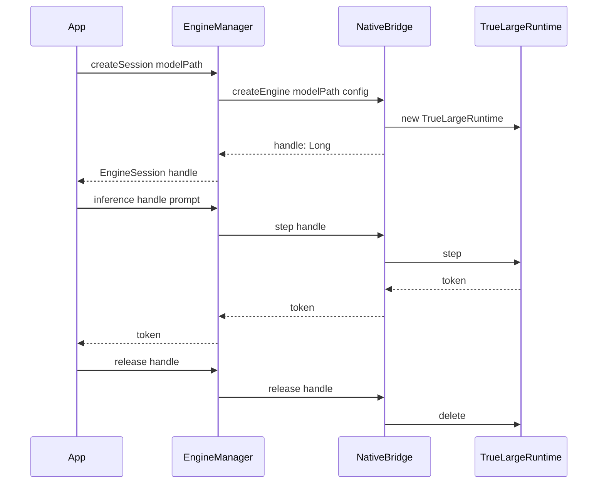
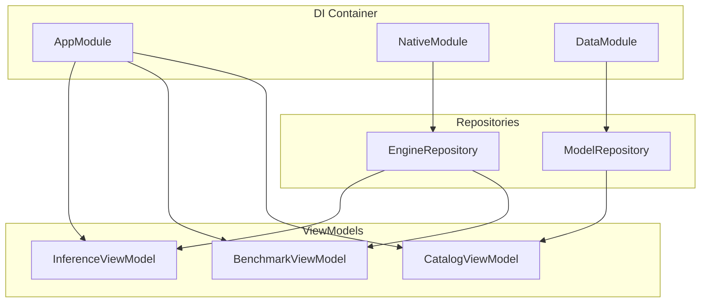
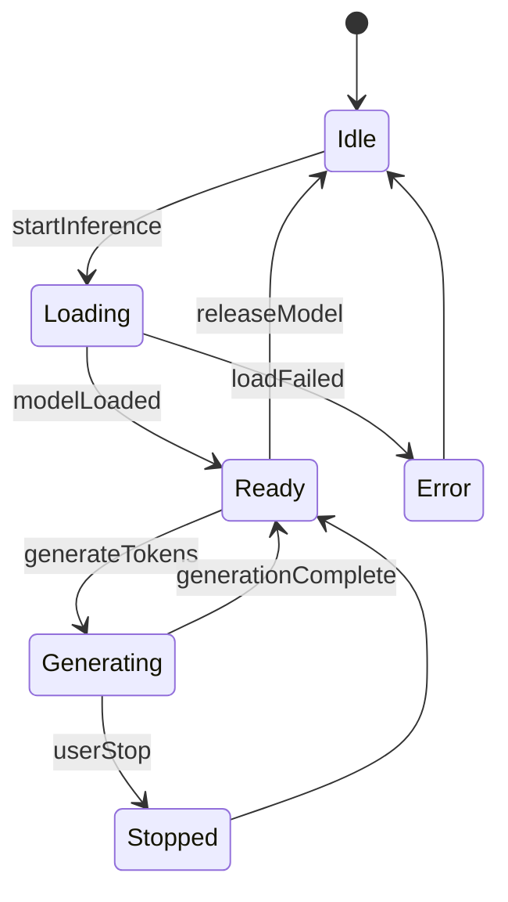
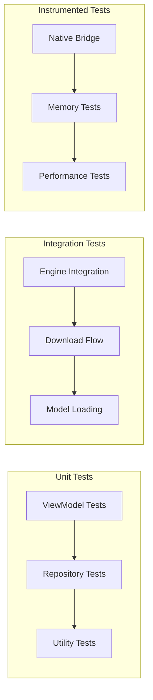
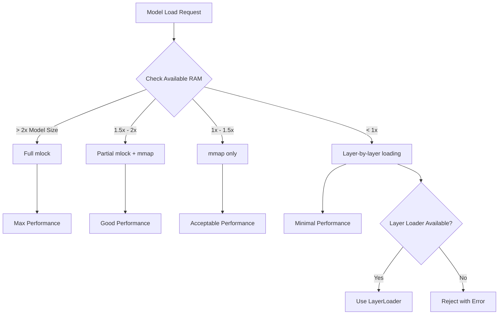
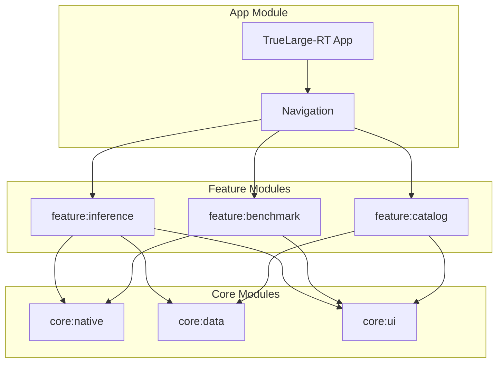

# TrueLarge-RT Architecture Review & Recommendations

## Executive Summary

TrueLarge-RT is a well-structured Android LLM inference engine built on llama.cpp. The current implementation demonstrates solid fundamentals with smart memory management, CPU affinity optimization, and real-time telemetry. This document outlines architectural improvements to enhance scalability, maintainability, and performance.

---

## Current Architecture Analysis

### Component Overview



### Strengths

| Area | Implementation | Assessment |
|------|----------------|------------|
| Memory Management | Dynamic mlock/mmap switching | ✅ Excellent |
| CPU Optimization | Big core affinity | ✅ Good |
| Telemetry | Real-time TPS/RAM/CPU tracking | ✅ Good |
| Model Discovery | Auto-discovery from Downloads | ✅ Good |
| Multi-turn | KV cache persistence | ✅ Good |

### Areas for Improvement

| Area | Current State | Risk Level |
|------|---------------|------------|
| Native Engine Lifecycle | Global singleton | 🔴 High |
| Dependency Injection | None | 🟡 Medium |
| Background Processing | Coroutine-only | 🟡 Medium |
| Error Handling | Basic | 🟡 Medium |
| Testing Infrastructure | None visible | 🔴 High |
| State Management | Local component state | 🟡 Medium |

---

## Recommended Architecture Improvements

### 1. Native Engine Lifecycle Management

**Current Issue**: The native engine uses a global singleton pattern in [`native-lib.cpp`](app/src/main/cpp/native-lib.cpp:8):

```cpp
// Current: Global singleton - NOT production-ready
static std::unique_ptr<TrueLargeRuntime> engine;
```

**Recommendation**: Implement a handle-based approach for proper lifecycle management.



**Proposed Implementation**:

```kotlin
// EngineManager.kt - Proper lifecycle management
class EngineManager {
    private val activeEngines = mutableMapOf<Long, EngineSession>()
    private var nextHandle: Long = 1
    
    data class EngineSession(
        val handle: Long,
        val modelPath: String,
        val createdAt: Long,
        var lastUsedAt: Long
    )
    
    suspend fun createSession(modelPath: String, config: EngineConfig): Result<EngineSession>
    suspend fun inference(handle: Long, prompt: String): Flow<Token>
    suspend fun release(handle: Long)
    fun releaseAll() // Call in Application.onTerminate
}
```

### 2. Dependency Injection with Hilt

**Recommendation**: Introduce Hilt for proper dependency management.



**Proposed Module Structure**:

```kotlin
// NativeModule.kt
@Module
@InstallIn(SingletonComponent::class)
object NativeModule {
    @Provides
    @Singleton
    fun provideEngineManager(): EngineManager = EngineManager()
    
    @Provides
    @Singleton
    fun provideEngineConfig(): EngineConfig = EngineConfig(
        threads = Runtime.getRuntime().availableProcessors().coerceIn(1, 4),
        gpuLayers = 0
    )
}

// DataModule.kt
@Module
@InstallIn(SingletonComponent::class)
object DataModule {
    @Provides
    @Singleton
    fun provideModelRepository(context: Context): ModelRepository = 
        ModelRepository(context)
    
    @Provides
    @Singleton
    fun provideHuggingFaceApi(): HuggingFaceApi = HuggingFaceApi()
}
```

### 3. Background Inference Service

**Current Issue**: Inference runs in Dispatchers.IO which may be killed by the system.

**Recommendation**: Implement a Foreground Service for long-running inference.



**Proposed Service Architecture**:

```kotlin
// InferenceService.kt
class InferenceService : LifecycleService() {
    
    companion object {
        private val binder = InferenceBinder()
        fun start(context: Context, config: InferenceConfig) { ... }
        fun stop(context: Context) { ... }
    }
    
    inner class InferenceBinder : Binder() {
        fun getEngine(): EngineManager = this@InferenceService.engineManager
        fun getState(): StateFlow<InferenceState> = this@InferenceService.state
        fun getOutput(): SharedFlow<Token> = this@InferenceService.outputFlow
    }
    
    // Handles OOM gracefully
    private fun handleLowMemory() { ... }
}
```

### 4. State Management with ViewModel + StateFlow

**Recommendation**: Move from local component state to ViewModel-based state management.

```kotlin
// InferenceViewModel.kt
@HiltViewModel
class InferenceViewModel @Inject constructor(
    private val engineManager: EngineManager,
    private val modelRepository: ModelRepository
) : ViewModel() {
    
    sealed interface State {
        object Idle : State
        object Loading : State
        data class Ready(val contextSize: Int) : State
        data class Generating(val tokens: Int, val tps: Double) : State
        data class Error(val message: String) : State
    }
    
    private val _state = MutableStateFlow<State>(State.Idle)
    val state: StateFlow<State> = _state.asStateFlow()
    
    private val _output = MutableSharedFlow<Token>()
    val output: SharedFlow<Token> = _output.asSharedFlow()
    
    private val _chatHistory = MutableStateFlow<List<ChatMessage>>(emptyList())
    val chatHistory: StateFlow<List<ChatMessage>> = _chatHistory.asStateFlow()
    
    fun loadModel(path: String) { ... }
    fun generate(prompt: String, config: GenerationConfig) { ... }
    fun stopGeneration() { ... }
    fun clearSession() { ... }
}
```

### 5. Error Handling Strategy

**Recommendation**: Implement comprehensive error handling with sealed classes.

```kotlin
// EngineError.kt
sealed class EngineError : Throwable {
    object ModelNotFound : EngineError()
    object OutOfMemory : EngineError()
    object InvalidModelFormat : EngineError()
    data class NativeError(val code: Int, val message: String) : EngineError()
    object ContextOverflow : EngineError()
    object EngineNotInitialized : EngineError()
}

// Result wrapper
sealed class EngineResult<out T> {
    data class Success<T>(val data: T) : EngineResult<T>()
    data class Error(val error: EngineError) : EngineResult<Nothing>()
    data class Loading(val progress: Float = 0f) : EngineResult<Nothing>()
}
```

### 6. Testing Infrastructure

**Recommendation**: Add comprehensive testing layers.



**Test Structure**:

```
app/src/
├── test/                          # Unit tests
│   └── java/com/truelarge/
│       ├── viewmodel/
│       │   ├── InferenceViewModelTest.kt
│       │   └── BenchmarkViewModelTest.kt
│       └── repository/
│           └── ModelRepositoryTest.kt
│
├── androidTest/                   # Instrumented tests
│   └── java/com/truelarge/
│       ├── native/
│       │   ├── NativeEngineTest.kt
│       │   └── MemoryManagementTest.kt
│       └── benchmark/
│           └── InferenceBenchmark.kt
```

### 7. Memory Management Enhancement

**Current Implementation** in [`TrueLargeRuntime.cpp`](app/src/main/cpp/TrueLargeRuntime.cpp:96-113):

```cpp
// Current: Basic RAM check
if (availRamKB > (fileSizeKB + 1024 * 1024)) {
    model_params.use_mlock = true;
} else {
    model_params.use_mlock = false;
}
```

**Recommendation**: Implement tiered memory strategy.



**Proposed Memory Strategy**:

```kotlin
// MemoryStrategy.kt
sealed class MemoryStrategy {
    data class FullLock(val estimatedRAM: Long) : MemoryStrategy()
    data class PartialLock(val lockedLayers: Int, val mmapLayers: Int) : MemoryStrategy()
    data class MmapOnly(val estimatedSwap: Long) : MemoryStrategy()
    data class LayerByLayer(val maxLayersInMemory: Int) : MemoryStrategy()
    object InsufficientMemory : MemoryStrategy()
    
    companion object {
        fun determine(modelSize: Long, availableRAM: Long): MemoryStrategy {
            val ratio = availableRAM.toDouble() / modelSize
            return when {
                ratio >= 2.0 -> FullLock(estimatedRAM = modelSize)
                ratio >= 1.5 -> PartialLock(lockedLayers = 60, mmapLayers = 40)
                ratio >= 1.0 -> MmapOnly(estimatedSwap = modelSize - availableRAM)
                ratio >= 0.5 -> LayerByLayer(maxLayersInMemory = (ratio * 100).toInt())
                else -> InsufficientMemory
            }
        }
    }
}
```

### 8. Modular Architecture Proposal

**Recommendation**: Split into feature modules for better separation.



**Module Structure**:

```
TrueLarge-RT/
├── app/                           # Main app module
│   └── src/main/
│       ├── MainActivity.kt
│       └── TrueLargeApplication.kt
│
├── feature/
│   ├── inference/                 # Inference feature
│   │   └── src/main/
│   │       ├── InferenceScreen.kt
│   │       └── InferenceViewModel.kt
│   │
│   ├── benchmark/                 # Benchmark feature
│   │   └── src/main/
│   │       ├── BenchmarkScreen.kt
│   │       └── BenchmarkViewModel.kt
│   │
│   └── catalog/                   # Model catalog feature
│       └── src/main/
│           ├── CatalogScreen.kt
│           └── CatalogViewModel.kt
│
├── core/
│   ├── native/                    # Native engine wrapper
│   │   └── src/main/
│   │       ├── cpp/              # C++ code
│   │       └── java/
│   │           ├── NativeEngine.kt
│   │           └── EngineManager.kt
│   │
│   ├── data/                      # Data layer
│   │   └── src/main/
│   │       └── java/
│   │           ├── ModelRepository.kt
│   │           └── HuggingFaceApi.kt
│   │
│   └── ui/                        # Shared UI components
│       └── src/main/
│           └── java/
│               ├── Theme.kt
│               └── Components.kt
```

---

## Implementation Priority

| Priority | Improvement | Impact | Effort |
|----------|-------------|--------|--------|
| 🔴 P0 | Native Engine Lifecycle | High | Medium |
| 🔴 P0 | Error Handling | High | Low |
| 🟡 P1 | ViewModel State Management | Medium | Medium |
| 🟡 P1 | Testing Infrastructure | Medium | High |
| 🟢 P2 | Dependency Injection | Medium | Medium |
| 🟢 P2 | Background Service | Medium | Medium |
| 🟢 P3 | Modular Architecture | Low | High |

---

## Quick Wins

These improvements can be implemented immediately with minimal code changes:

### 1. Add Result Wrapper to NativeEngine

```kotlin
// NativeEngine.kt - Enhanced error handling
class NativeEngine {
    sealed class InitResult {
        data class Success(val contextSize: Int) : InitResult()
        data class Error(val code: Int, val message: String) : InitResult()
    }
    
    fun initWithResult(modelPath: String, threads: Int, gpuLayers: Int): InitResult {
        return try {
            val success = init(modelPath, threads, gpuLayers)
            if (success) InitResult.Success(getContextTrain())
            else InitResult.Error(-1, "Unknown error")
        } catch (e: Exception) {
            InitResult.Error(-2, e.message ?: "Exception")
        }
    }
}
```

### 2. Add Memory Warning Threshold

```cpp
// TrueLargeRuntime.cpp - Add memory warning
bool TrueLargeRuntime::loadModel(const std::string& path) {
    // ... existing code ...
    
    // Add warning threshold
    const long WARNING_THRESHOLD_KB = 512 * 1024; // 512MB
    if (availRamKB < (fileSizeKB + WARNING_THRESHOLD_KB)) {
        LOGW("WARNING: Low memory condition. Model may cause OOM.");
        // Optionally: emit warning to Java layer
    }
    
    // ... rest of loading code ...
}
```

### 3. Add Coroutine Scope Management

```kotlin
// MainActivity.kt - Proper scope management
class MainActivity : ComponentActivity() {
    private val mainScope = MainScope()
    
    override fun onDestroy() {
        super.onDestroy()
        mainScope.cancel() // Cancel all coroutines
        engine.release()   // Release native resources
    }
}
```

---

## Conclusion

The TrueLarge-RT project has a solid foundation with excellent native optimization. The recommended improvements focus on:

1. **Production Readiness**: Proper lifecycle management and error handling
2. **Maintainability**: Dependency injection and modular architecture
3. **Testability**: Comprehensive testing infrastructure
4. **User Experience**: Background service and better state management

Implementing these suggestions will transform TrueLarge-RT from a capable POC into a production-ready Android LLM runtime.
